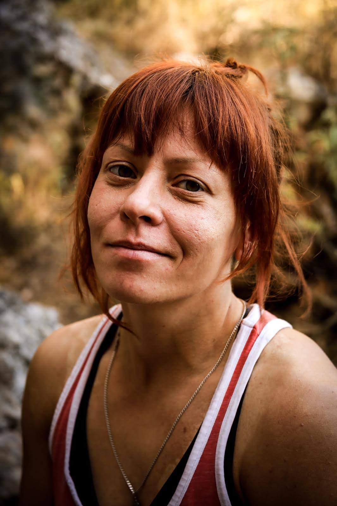

Инструктор скалолазания и гид по горным маршрутам Турции и Красноярска. Родом из Красноярска, около 17 лет занимаюсь альпинизмом и скалолазанием. Мастер спорта по альпинизму. Чемпион России по альпинизму и призер чемпионатов России по альпинизму в скальном классе. В настоящее время проживаю в Турции (Гейкбаири, Кемер)
